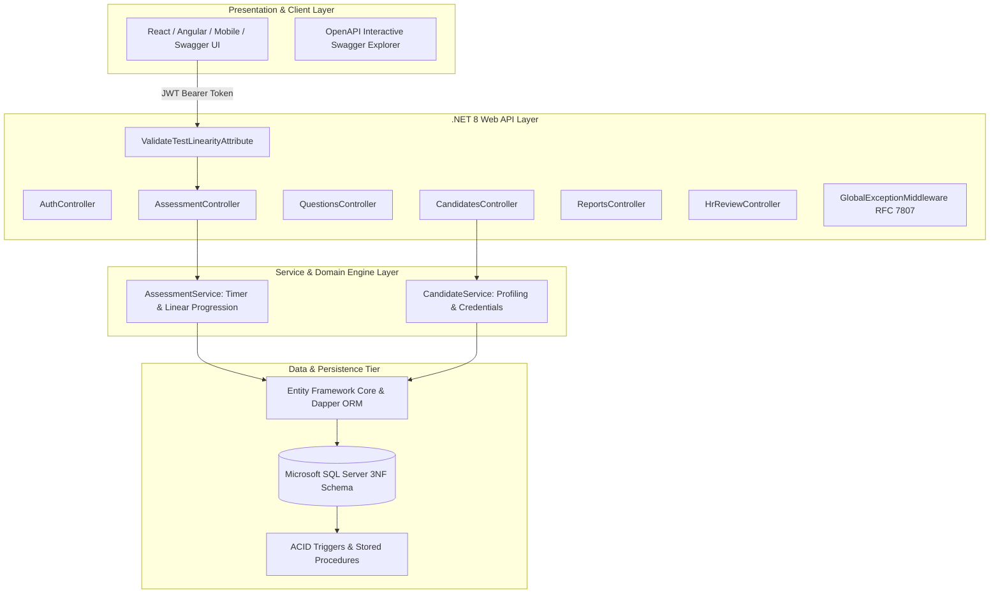

# Webster Organisation - Online Aptitude Test & Recruitment System

[](https://dotnet.microsoft.com/)
[](https://learn.microsoft.com/en-us/dotnet/csharp/)
[](https://www.microsoft.com/en-us/sql-server/)
[](http://localhost:5000)
[](#architecture-overview)
[](LICENSE)

An enterprise-grade, 3-tier recruitment assessment API built for university project evaluation, semester defense, and DBMS viva voce. Based on the **Webster Organisation Software Requirements Specification (SRS)**, this solution provides candidate management, linear multi-stage aptitude assessments, automated countdown timers, dynamic scoring, and trigger-driven transfer to the HR interview pipeline.

---

## Table of Contents
- [Architecture Overview](#architecture-overview)
- [Linear 3-Stage Assessment Engine](#linear-3-stage-assessment-engine)
- [Database Schema (11 Normalized 3NF Tables)](#database-schema-11-normalized-3nf-tables)
- [Pre-Seeded Test Credentials](#pre-seeded-test-credentials)
- [Quickstart & Execution Guide](#quickstart--execution-guide)
- [API Endpoints Reference](#api-endpoints-reference)
- [Automated HR Transfer Engine](#automated-hr-transfer-engine)
- [Project Evaluation & Viva Resources](#project-evaluation--viva-resources)

---

## Architecture Overview



---

## Linear 3-Stage Assessment Engine

Candidates advance through a non-reversible sequential pipeline. Each section is strictly time-bound and automatically locks upon completion:

```
[Start Test] 
     │
     ▼
[Round 1: General Knowledge] ──────► 5 Questions | 5 Mins Timer | Locks on Submit
     │
     ▼
[Round 2: Mathematics] ────────────► 5 Questions | 8 Mins Timer | Back-navigation blocked
     │
     ▼
[Round 3: Computer Technology] ────► 5 Questions | 7 Mins Timer | Final Round
     │
     ▼
[Finalize & Calculate Score]
     │
     ├─────────► If Aggregate >= 60%: "You have cleared this round, next round would be HR Round"
     │                                └─► Trigger auto-transfers to AptiClearedCandidates
     │
     └─────────► If Aggregate < 60%: "Assessment completed. You did not meet the cutoff threshold."
```

---

## Database Schema (11 Normalized 3NF Tables)

The system features a fully normalized 3NF relational database schema:

| # | Table Name | Purpose & Cardinality |
| :-: | :--- | :--- |
| **1** | `Managers` | Administrative users & HR recruitment officers who enroll applicants and maintain question banks. |
| **2** | `Candidates` | Candidate master directory with registration numbers (`WEB-YYYY-XXX`) and contact details. |
| **3** | `CandidateEducations` | Multi-valued academic qualifications (Degrees, Institutes, CGPA, Passing Years). |
| **4** | `CandidateExperiences` | Prior employment history (Company, Designation, Total Years, Key Skills). |
| **5** | `TestSections` | Sequential test rounds (`General_Knowledge`, `Mathematics`, `Computer_Technology`). |
| **6** | `Questions` | Question repository categorized by section with configurable marks (1-5). |
| **7** | `QuestionOptions` | Multi-choice alternatives (A, B, C, D) with master scoring key indicator (`IsCorrect`). |
| **8** | `TestAttempts` | Core exam session state tracking active section, server timer, total score, and exam status. |
| **9** | `CandidateResponses` | Audit trail of submitted answers and points awarded per question. |
| **10** | `AptiClearedCandidates` | Automated transfer table populated by database triggers for candidates passing the assessment. |
| **11** | `AssessmentAuditLogs` | Immutable security log tracking section progression, countdown timeouts, and HR transfers. |

---

## Pre-Seeded Test Credentials

The database and in-memory mock engine come pre-populated with ready-to-test accounts:

### 1. Administrative Managers (Full Access)
| Name | Email / Identifier | Password | Role | Office Location |
| :--- | :--- | :--- | :--- | :--- |
| **Sarah Jenkins** | `sarah.jenkins@webster.org` | `Password@123` | `Manager` | New York Global HQ |
| **David Sterling** | `david.sterling@webster.org` | `Password@123` | `Manager` | London EMEA Operations |

### 2. Demo Candidates
| Candidate Name | Username / Email | Password | Status in Seed Data |
| :--- | :--- | :--- | :--- |
| **Alexander Hayes** | `alex.hayes` | `Password@123` | Completed & Passed (86.96%) -> Transferred to HR |
| **Priya Sharma** | `priya.sharma` | `Password@123` | Completed & Passed (100.00%) -> Transferred to HR |
| **Marcus Vance** | `marcus.vance` | `Password@123` | Completed & Failed (34.78%) |
| **Elena Rostova** | `elena.rostova` | `Password@123` | In Progress (Currently on Mathematics) |
| **Chen Wei** | `chen.wei` | `Password@123` | Enrolled (Ready to start test) |
| **Sofia Mendez** | `sofia.mendez` | `Password@123` | Enrolled (Ready to start test) |

---

## Quickstart & Execution Guide

### Option A: Zero-Config In-Memory Mode (Ideal for Classroom / Viva Defense)
You can run and evaluate the entire system immediately without installing or configuring SQL Server. The application auto-detects configuration and seeds full mock data in memory.

```bash
# Clone the repository
git clone https://github.com/affaan-891/online-aptitude-test-recruitment-api.git
cd online-aptitude-test-recruitment-api

# Run the API with in-memory database enabled
dotnet run --project src/AptitudePortal.Api.csproj --launch-profile Development
```

Open your browser to explore the interactive Swagger documentation:
👉 **`http://localhost:5000`** or **`http://localhost:5000/swagger`**

---

### Option B: Microsoft SQL Server Production Setup
To run against a local Microsoft SQL Server or LocalDB instance:

1. Open SQL Server Management Studio (SSMS) or Azure Data Studio.
2. Execute the scripts in `database/` in sequential order:
   - `01_schema_sqlserver.sql` (Creates database, 11 tables, and indexes)
   - `02_triggers_and_procedures.sql` (Deploys stage gate triggers and scoring procs)
   - `03_views_and_queries.sql` (Installs HR pipeline views and viva queries)
   - `04_seed_data.sql` (Populates managers, candidates, and 15 questions)
3. In `src/appsettings.json`, set `"UseInMemoryDatabase": false` and verify your connection string.
4. Launch the application:
   ```bash
   dotnet run --project src/AptitudePortal.Api.csproj
   ```

---

## API Endpoints Reference

### 1. Authentication (`/api/auth`)
- `POST /api/auth/login`: Authenticates Manager or Candidate and returns signed JWT Bearer token with claims.

### 2. Candidate Profiling (`/api/candidates`) - Manager Only
- `POST /api/candidates/enroll`: Enrolls candidate with academic degrees, work experience, and provisions login credentials.
- `GET /api/candidates`: Lists all enrolled applicants with test status.
- `GET /api/candidates/{id}`: Returns complete candidate dossier.

### 3. Question Bank Management (`/api/questions`) - Manager Only
- `GET /api/questions?sectionId={id}`: Retrieves questions filtered by section.
- `GET /api/questions/{id}`: Retrieves question with full answer options and scoring key.
- `POST /api/questions`: Creates question with options and point weighting (1-5 marks).
- `PUT /api/questions/{id}`: Updates question text, options, or active status.
- `DELETE /api/questions/{id}`: Soft-deletes a question.

### 4. Assessment Engine (`/api/assessment`) - Candidate Only
- `POST /api/assessment/start`: Begins Section 1 (General Knowledge) with server countdown timer.
- `POST /api/assessment/submit-section`: Submits current round, validates timer, computes intermediate marks, and unlocks next round.
- `POST /api/assessment/complete`: Finalizes assessment, checks cumulative cutoff (60%), and triggers transfer.
- `GET /api/assessment/status`: Checks remaining time and current active round.

### 5. HR Review Pipeline (`/api/hrreview`) - Manager Only
- `GET /api/hrreview/pipeline`: Retrieves queue of candidates who passed aptitude test.
- `PATCH /api/hrreview/{clearanceId}/status`: Updates interview status (`Scheduled`, `Selected`, `Rejected`) and remarks.

### 6. Recruitment Analytics & Reports (`/api/reports`) - Manager Only
- `GET /api/reports/recruitment-summary?filterType=WEEKLY`: Recruitment funnel metrics (Enrolled, Appeared, Cleared, Conversion Rate) for `DAILY`, `WEEKLY`, or `MONTHLY`.
- `GET /api/reports/sectional-benchmarks`: Accuracy and difficulty analytics across GK, Math, and CS sections.

---

## Automated HR Transfer Engine

When a candidate submits Section 3 (Computer Technology) and completes the assessment:
1. `AssessmentService` calculates cumulative marks across all questions answered.
2. If aggregate percentage $\ge 60\%$:
   - `TestAttempts.IsPassed` is set to `1` and status becomes `Completed`.
   - The database trigger `trg_TransferAptiClearedCandidate` fires atomically.
   - Candidate is inserted into `AptiClearedCandidates` with `HrInterviewStatus = 'Pending'`.
   - Candidate receives the prompt:
     > **"You have cleared this round, next round would be HR Round"**
3. If aggregate percentage $< 60\%$:
   - Status becomes `Completed` and `IsPassed = 0`.
   - Candidate receives:
     > **"Assessment completed. Unfortunately, you did not meet the required cutoff threshold."**

---

## Project Evaluation & Viva Resources

This repository includes comprehensive academic defense documentation:
- 📖 [docs/SRS_ANALYSIS.md](docs/SRS_ANALYSIS.md): Complete functional/non-functional breakdown, User Roles & Linear State Matrix.
- 📐 [docs/ERD.md](docs/ERD.md): Crow's Foot Mermaid.js ER diagram & complete 11-table Data Dictionary.
- 🎓 [docs/VIVA_QUESTIONS.md](docs/VIVA_QUESTIONS.md): 12 high-difficulty viva voce defense questions with detailed model answers.
- 📊 [database/03_views_and_queries.sql](database/03_views_and_queries.sql): 5 complex SQL defense queries covering `NOT EXISTS`, `DENSE_RANK()`, duration calculations, and execution plans.

---

## License
This project is open-source and released under the [MIT License](LICENSE). Built for academic submission and enterprise reference.
