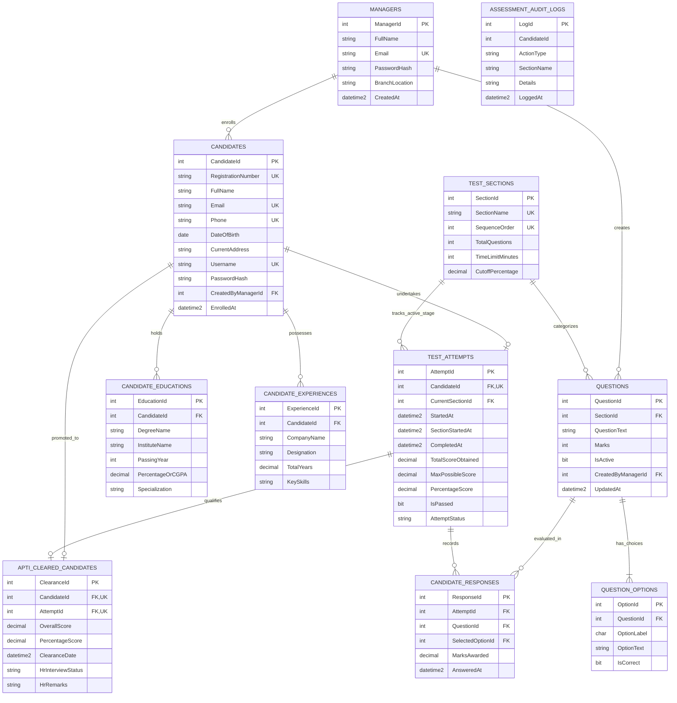

# Entity Relationship Diagram & Data Dictionary
## Webster Organisation - Online Aptitude Test & Recruitment System

---

### 1. Crow's Foot Entity-Relationship Diagram (Mermaid.js)

---

### 2. Comprehensive Data Dictionary (11 Normalized Tables)

#### Table 1: `Managers`
Stores administrative staff and HR recruitment officers authorized to manage candidates and question banks.

| Column Name | Data Type | Nullable | Key / Constraint | Description |
| :--- | :--- | :---: | :---: | :--- |
| `ManagerId` | `INT IDENTITY(1,1)` | NO | **PK** | Surrogate primary key |
| `FullName` | `NVARCHAR(100)` | NO | - | Full legal name of the manager |
| `Email` | `NVARCHAR(150)` | NO | **UNIQUE** | Corporate email address for login |
| `PasswordHash` | `NVARCHAR(255)` | NO | - | BCrypt cryptographically hashed password |
| `BranchLocation`| `NVARCHAR(100)` | NO | - | Office branch (e.g. New York HQ, London EMEA) |
| `CreatedAt` | `DATETIME2(3)` | NO | `DEFAULT SYSUTCDATETIME()` | UTC timestamp of record creation |

---

#### Table 2: `Candidates`
Master entity for job applicants registered to participate in the online aptitude recruitment drive.

| Column Name | Data Type | Nullable | Key / Constraint | Description |
| :--- | :--- | :---: | :---: | :--- |
| `CandidateId` | `INT IDENTITY(1,1)` | NO | **PK** | Surrogate primary key |
| `RegistrationNumber` | `NVARCHAR(50)` | NO | **UNIQUE** | Auto-generated applicant identifier (`WEB-YYYY-XXX`) |
| `FullName` | `NVARCHAR(100)` | NO | - | Candidate's complete name |
| `Email` | `NVARCHAR(150)` | NO | **UNIQUE** | Primary contact email |
| `Phone` | `NVARCHAR(20)` | NO | **UNIQUE** | Mobile/contact telephone number |
| `DateOfBirth` | `DATE` | NO | - | Date of birth for age eligibility verification |
| `CurrentAddress` | `NVARCHAR(250)` | NO | - | Residential physical address |
| `Username` | `NVARCHAR(50)` | NO | **UNIQUE** | System login username |
| `PasswordHash` | `NVARCHAR(255)` | NO | - | BCrypt hashed password |
| `CreatedByManagerId` | `INT` | NO | **FK -> Managers** | Manager who registered this candidate |
| `EnrolledAt` | `DATETIME2(3)` | NO | `DEFAULT SYSUTCDATETIME()` | Enrolment timestamp in UTC |

---

#### Table 3: `CandidateEducations`
Child relation capturing multi-valued academic credentials (prevents 1NF repeating group violations).

| Column Name | Data Type | Nullable | Key / Constraint | Description |
| :--- | :--- | :---: | :---: | :--- |
| `EducationId` | `INT IDENTITY(1,1)` | NO | **PK** | Surrogate primary key |
| `CandidateId` | `INT` | NO | **FK -> Candidates (CASCADE)** | Parent candidate identifier |
| `DegreeName` | `NVARCHAR(100)` | NO | - | Degree title (e.g., B.S. Computer Science) |
| `InstituteName` | `NVARCHAR(150)` | NO | - | University or educational institution |
| `PassingYear` | `INT` | NO | `CHECK (1970 - 2100)` | Year of graduation |
| `PercentageOrCGPA` | `DECIMAL(5,2)` | NO | `CHECK (>= 0 AND <= 100)` | Academic score / grade percentage |
| `Specialization`| `NVARCHAR(100)` | NO | - | Major focus area (e.g., Software Systems) |

---

#### Table 4: `CandidateExperiences`
Child relation capturing prior employment records and industry skill profiles.

| Column Name | Data Type | Nullable | Key / Constraint | Description |
| :--- | :--- | :---: | :---: | :--- |
| `ExperienceId` | `INT IDENTITY(1,1)` | NO | **PK** | Surrogate primary key |
| `CandidateId` | `INT` | NO | **FK -> Candidates (CASCADE)** | Parent candidate identifier |
| `CompanyName` | `NVARCHAR(150)` | NO | - | Name of past employing organisation |
| `Designation` | `NVARCHAR(100)` | NO | - | Professional job title held |
| `TotalYears` | `DECIMAL(4,1)` | NO | `CHECK (>= 0.0)` | Duration of tenure in years |
| `KeySkills` | `NVARCHAR(250)` | NO | - | Comma-separated list of competencies |

---

#### Table 5: `TestSections`
Defines the sequential linear assessment rounds with sequence ordering and time parameters.

| Column Name | Data Type | Nullable | Key / Constraint | Description |
| :--- | :--- | :---: | :---: | :--- |
| `SectionId` | `INT IDENTITY(1,1)` | NO | **PK** | Surrogate primary key |
| `SectionName` | `NVARCHAR(50)` | NO | **UNIQUE, CHECK IN(...)** | `General_Knowledge`, `Mathematics`, `Computer_Technology` |
| `SequenceOrder` | `INT` | NO | **UNIQUE, CHECK (>= 1)** | 1, 2, or 3 enforcing strict linear order |
| `TotalQuestions`| `INT` | NO | `DEFAULT 5` | Number of questions presented |
| `TimeLimitMinutes`| `INT` | NO | `CHECK (> 0)` | Allotted countdown timer in minutes |
| `CutoffPercentage`| `DECIMAL(5,2)` | NO | `CHECK (0 - 100)` | Sectional minimum passing benchmark |

---

#### Table 6: `Questions`
Central question repository categorized by test round and managed by HR recruitment leads.

| Column Name | Data Type | Nullable | Key / Constraint | Description |
| :--- | :--- | :---: | :---: | :--- |
| `QuestionId` | `INT IDENTITY(1,1)` | NO | **PK** | Surrogate primary key |
| `SectionId` | `INT` | NO | **FK -> TestSections** | Target test section |
| `QuestionText` | `NVARCHAR(MAX)` | NO | - | Question narrative |
| `Marks` | `INT` | NO | `DEFAULT 1, CHECK (1-5)` | Score weight allocated to this question |
| `IsActive` | `BIT` | NO | `DEFAULT 1` | Soft-delete / active toggle |
| `CreatedByManagerId` | `INT` | NO | **FK -> Managers** | Authoring manager |
| `UpdatedAt` | `DATETIME2(3)` | NO | `DEFAULT SYSUTCDATETIME()` | Last modification timestamp in UTC |

---

#### Table 7: `QuestionOptions`
Multi-choice answer alternatives for each question. Exactly one option is marked correct.

| Column Name | Data Type | Nullable | Key / Constraint | Description |
| :--- | :--- | :---: | :---: | :--- |
| `OptionId` | `INT IDENTITY(1,1)` | NO | **PK** | Surrogate primary key |
| `QuestionId` | `INT` | NO | **FK -> Questions (CASCADE)** | Parent question |
| `OptionLabel` | `CHAR(1)` | NO | `CHECK IN ('A','B','C','D')` | Option identifier |
| `OptionText` | `NVARCHAR(500)` | NO | - | Option display text |
| `IsCorrect` | `BIT` | NO | `DEFAULT 0` | Master scoring key indicator |

---

#### Table 8: `TestAttempts`
Core state engine tracking candidate progress, active section, score totals, and exam status.

| Column Name | Data Type | Nullable | Key / Constraint | Description |
| :--- | :--- | :---: | :---: | :--- |
| `AttemptId` | `INT IDENTITY(1,1)` | NO | **PK** | Surrogate primary key |
| `CandidateId` | `INT` | NO | **FK, UNIQUE -> Candidates** | Single attempt constraint per candidate |
| `CurrentSectionId` | `INT` | NO | **FK -> TestSections** | Active round pointer for linearity check |
| `StartedAt` | `DATETIME2(3)` | NO | `DEFAULT SYSUTCDATETIME()` | Test initiation timestamp |
| `SectionStartedAt` | `DATETIME2(3)` | NO | `DEFAULT SYSUTCDATETIME()` | Timestamp current round commenced |
| `CompletedAt` | `DATETIME2(3)` | YES | - | Final submission timestamp |
| `TotalScoreObtained` | `DECIMAL(6,2)` | NO | `DEFAULT 0.00` | Aggregated points scored |
| `MaxPossibleScore` | `DECIMAL(6,2)` | NO | `DEFAULT 0.00` | Maximum possible marks across rounds |
| `PercentageScore` | `DECIMAL(5,2)` | NO | `DEFAULT 0.00` | Normalized percentage score |
| `IsPassed` | `BIT` | NO | `DEFAULT 0` | 1 if score meets cutoff, else 0 |
| `AttemptStatus` | `NVARCHAR(30)` | NO | `CHECK IN(...)` | `Not_Started`, `In_Progress`, `Timed_Out`, `Completed` |

---

#### Table 9: `CandidateResponses`
Atomic storage of choices submitted by candidates for each question.

| Column Name | Data Type | Nullable | Key / Constraint | Description |
| :--- | :--- | :---: | :---: | :--- |
| `ResponseId` | `INT IDENTITY(1,1)` | NO | **PK** | Surrogate primary key |
| `AttemptId` | `INT` | NO | **FK -> TestAttempts (CASCADE)** | Target assessment session |
| `QuestionId` | `INT` | NO | **FK -> Questions** | Evaluated question |
| `SelectedOptionId` | `INT` | YES | **FK -> QuestionOptions** | Candidate's choice (NULL if skipped) |
| `MarksAwarded` | `DECIMAL(4,2)` | NO | `DEFAULT 0.00` | Points computed by scoring proc |
| `AnsweredAt` | `DATETIME2(3)` | NO | `DEFAULT SYSUTCDATETIME()` | Response submission timestamp |

---

#### Table 10: `AptiClearedCandidates`
Automated transfer table populated by database trigger `trg_TransferAptiClearedCandidate` for candidates qualifying for the HR Interview Round.

| Column Name | Data Type | Nullable | Key / Constraint | Description |
| :--- | :--- | :---: | :---: | :--- |
| `ClearanceId` | `INT IDENTITY(1,1)` | NO | **PK** | Surrogate primary key |
| `CandidateId` | `INT` | NO | **FK, UNIQUE -> Candidates** | One clearance record per candidate |
| `AttemptId` | `INT` | NO | **FK, UNIQUE -> TestAttempts** | Reference to passing exam session |
| `OverallScore` | `DECIMAL(6,2)` | NO | - | Cumulative aptitude marks |
| `PercentageScore` | `DECIMAL(5,2)` | NO | - | Cumulative percentage |
| `ClearanceDate` | `DATETIME2(3)` | NO | `DEFAULT SYSUTCDATETIME()` | Timestamp promoted to HR queue |
| `HrInterviewStatus` | `NVARCHAR(30)` | NO | `CHECK IN(...)` | `Pending`, `Scheduled`, `Selected`, `Rejected` |
| `HrRemarks` | `NVARCHAR(MAX)` | YES | - | Evaluator notes from HR interview |

---

#### Table 11: `AssessmentAuditLogs`
Security and forensic log tracking stage transitions, countdown timeouts, and candidate transfers.

| Column Name | Data Type | Nullable | Key / Constraint | Description |
| :--- | :--- | :---: | :---: | :--- |
| `LogId` | `INT IDENTITY(1,1)` | NO | **PK** | Surrogate primary key |
| `CandidateId` | `INT` | YES | - | Candidate involved (if applicable) |
| `ActionType` | `NVARCHAR(50)` | NO | - | e.g., `SECTION_TRANSITION`, `HR_PIPELINE_TRANSFER` |
| `SectionName` | `NVARCHAR(50)` | YES | - | Target section affected |
| `Details` | `NVARCHAR(MAX)` | YES | - | Technical trace and diagnostic info |
| `LoggedAt` | `DATETIME2(3)` | NO | `DEFAULT SYSUTCDATETIME()` | Audit event timestamp in UTC |

---

### 3. Normalization Proof (3NF Compliance)

1. **First Normal Form (1NF)**:
   - All columns contain atomic, indivisible values.
   - Repeating groups (e.g. multiple degrees, work experiences, multi-choice options) have been segregated into distinct child relations (`CandidateEducations`, `CandidateExperiences`, `QuestionOptions`).

2. **Second Normal Form (2NF)**:
   - The schema satisfies 1NF.
   - Every non-key attribute is fully functionally dependent on the entire primary key (no partial dependencies on composite keys). All tables employ dedicated surrogate keys with unique business alternate keys.

3. **Third Normal Form (3NF)**:
   - The schema satisfies 2NF.
   - No transitive functional dependencies exist ($X \to Y$ and $Y \to Z$). Candidate academic details depend solely on `EducationId`; question options depend strictly on `OptionId`; manager branch metadata is localized in `Managers`.
