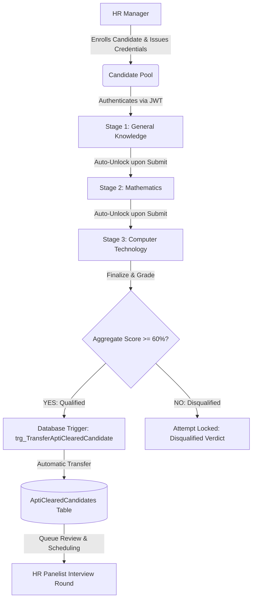
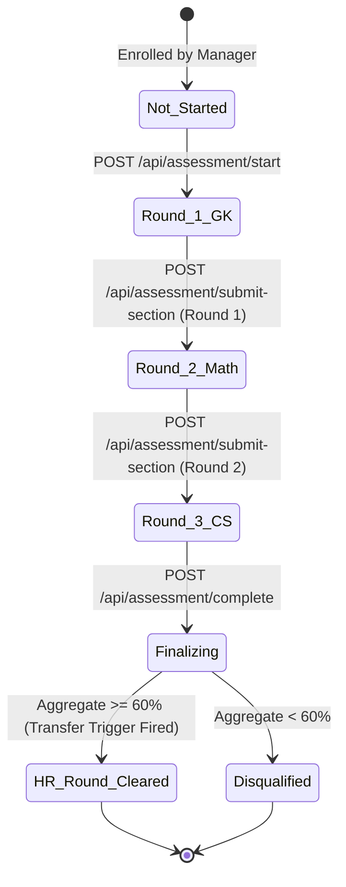

# Software Requirements Specification (SRS) Analysis
## Webster Organisation - Online Aptitude Test & Recruitment System

---

### 1. Executive Summary & System Scope
The **Webster Organisation - Online Aptitude Test & Recruitment System** is an enterprise-tier recruitment assessment engine designed to screen, evaluate, and qualify graduate and lateral job applicants. The platform eliminates manual paper-based testing and subjective scoring by providing an automated, strictly controlled, multi-stage assessment pipeline backed by Microsoft SQL Server and .NET 8.

---

### 2. User Roles & Permission Matrix

| Functional Capability | Manager / Administrator | Candidate / Applicant | HR Panelist |
| :--- | :---: | :---: | :---: |
| Candidate Biodata & Credential Enrollment | **YES** (CRUD) | NO | Read Only |
| Educational Background & Experience Capture | **YES** | Read Only (Own) | **YES** |
| Question Bank & Section Configuration | **YES** (CRUD) | NO | NO |
| Test Initiation & Sequential Answering | NO | **YES** (Strict Linear) | NO |
| Real-time Countdown Timer Verification | NO | Enforced by Server | NO |
| AptiClearedCandidates Queue Access | **YES** | NO | **YES** |
| HR Interview Status Update (Scheduled/Selected) | **YES** | NO | **YES** |
| Recruitment Funnel Analytics & Reporting | **YES** (Date/Week/Month) | NO | Read Only |

---

### 3. Linear 3-Stage Assessment State Matrix

The Webster assessment engine strictly implements a non-reversible, deterministic state machine:

#### Stage Specifications:
1. **Section 1: General Knowledge (`General_Knowledge`)**
   - **Order**: Sequence 1 (Entry point).
   - **Questions**: 5 questions (1 to 2 marks each).
   - **Time Limit**: 5 minutes countdown enforced by server.
   - **State Policy**: On submission, responses are permanently committed to `CandidateResponses`. Back-navigation is physically prohibited.

2. **Section 2: Mathematics (`Mathematics`)**
   - **Order**: Sequence 2.
   - **Prerequisite**: Section 1 must be submitted. Direct jump from entry to Section 2 triggers `Linearity Violation`.
   - **Questions**: 5 questions (1 to 2 marks each).
   - **Time Limit**: 8 minutes countdown.
   - **State Policy**: Cannot return to Section 1 to revise answers.

3. **Section 3: Computer Technology (`Computer_Technology`)**
   - **Order**: Sequence 3 (Final round).
   - **Prerequisite**: Section 2 must be submitted.
   - **Questions**: 5 questions (1 to 2 marks each).
   - **Time Limit**: 7 minutes countdown.
   - **State Policy**: Once submitted, marks assessment as ready for finalization.

---

### 4. Anti-Cheating & Integrity Mechanics

1. **Server-Authoritative Clock**:
   - The test timer is maintained and calculated on the server (`TestAttempts.SectionStartedAt`).
   - Client-side system clock tampering does not affect the remaining duration.
   - Submissions exceeding `TimeLimitMinutes * 60 + 15s (grace)` are flagged in `AssessmentAuditLogs`. Overruns beyond 2 minutes automatically transition the session to `Timed_Out`.

2. **Zero Answer Key Leakage**:
   - The candidate question query explicitly projects only `QuestionId`, `QuestionText`, `Marks`, and `Options (OptionId, OptionLabel, OptionText)`.
   - The `IsCorrect` boolean is never transmitted over the network to the candidate's browser/client.

3. **Database-Level Stage Gate Trigger**:
   - `trg_EnforceLinearSectionFlow` inspects every update on `TestAttempts`.
   - Any transaction attempting to decrease `SequenceOrder` or skip more than 1 sequence step is immediately rolled back via `ROLLBACK TRANSACTION; RAISERROR(...)`.

4. **Single-Attempt Idempotency**:
   - Candidate ID has a unique constraint on `TestAttempts.CandidateId`.
   - Once `AttemptStatus = 'Completed'`, any subsequent call to `/api/assessment/start` rejects execution with HTTP 400 Bad Request.

---

### 5. Automated Transfer Engine (`AptiClearedCandidates`)

Upon final scoring:
- If cumulative score percentage >= 60.00%:
  - The assessment status becomes `Completed` and `IsPassed = 1`.
  - Database trigger `trg_TransferAptiClearedCandidate` fires atomically.
  - Candidate record is inserted into `AptiClearedCandidates` with status `Pending`.
  - The API returns the prompt:
    > *"You have cleared this round, next round would be HR Round"*
- If cumulative score percentage < 60.00%:
  - Candidate status becomes `Completed` and `IsPassed = 0`.
  - The API returns:
    > *"Assessment completed. Unfortunately, you did not meet the required cutoff threshold."*

---

### 6. Functional Requirements Traceability Matrix

| Requirement ID | Module | Specification Description | Implementation Artifact |
| :--- | :--- | :--- | :--- |
| **FR-01** | Auth | Secure Manager & Candidate authentication with JWT claims | `AuthController.cs` |
| **FR-02** | Profiling | Capture personal, degree qualifications, and work history | `CandidatesController.cs`, `01_schema_sqlserver.sql` |
| **FR-03** | Provisioning | Automatic generation of unique username, RegNo, and password | `CandidateService.cs` |
| **FR-04** | Question Bank | Manager CRUD across GK, Math, CS with marks (1-5) | `QuestionsController.cs`, `Questions` table |
| **FR-05** | Stage Gating | Sequential 3-stage progress with no back-navigation | `ValidateTestLinearityAttribute.cs`, `trg_EnforceLinearSectionFlow` |
| **FR-06** | Timer Engine | Countdown timer validation with network latency tolerance | `AssessmentService.cs`, `sp_SubmitSectionAnswers` |
| **FR-07** | Auto Scoring | Dynamic mark calculation per question upon submission | `AssessmentService.cs`, `CandidateResponses` |
| **FR-08** | Transfer Trigger | Automatic promotion of cleared applicants to HR queue | `trg_TransferAptiClearedCandidate`, `AptiClearedCandidates` |
| **FR-09** | HR Review | HR dashboard for status updates (Scheduled, Selected, Rejected)| `HrReviewController.cs` |
| **FR-10** | Analytics | Funnel reporting filtered by Day, Week, and Month | `ReportsController.cs`, `sp_GetRecruitmentSummaryReport` |
| **FR-11** | Audit Trail | Security audit logging for transitions, timeouts, and transfers| `AssessmentAuditLogs` table |
| **FR-12** | Benchmarks | Sectional accuracy and performance analytics | `vw_SectionalPerformanceBenchmark` |
